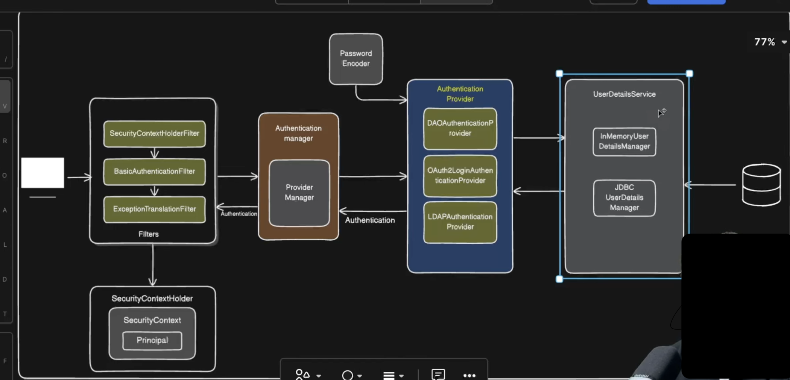

Some basic notes:
- Whenever you add spring security dependency to your project, spring automatically adds a default form based authentication (UsernameAndPasswordAuthenticationFilter)
- The default auth will have user as `user` and `password` is auto generated when the app starts up.
- By adding a simple SecurityFilterChain config with .httpBasic(withDefaults()), we can add explicit user and password in app.yml
- spring.security.user.name & spring.security.user.password
- 

Basic auth module notes:
- This module accepts username and password in the request payload.
- Checks it against the H2 db table.
- If exists and if the info is correct, request succeeds. Else 401
- Working mechanism:
  - Controller endpoint is hit
  - Triggers SecurityFilterChain block. Any non-authorization url are accepted without any auth. Others require auth.
  - .httpBasic(Customizer.withDefaults()) will trigger BasicAuthenticationFilter authentication
  - 

Jwt auth module notes:
- This module accepts username and password as a request from /authenticate endpoint.
- It will use BasicUserNameAndPassword Authentication mechanism to check if requested user/password is correct as per H2 db data.
- If correct, it is going to create a JWT token that can be used by subsequent controller endpoints.

